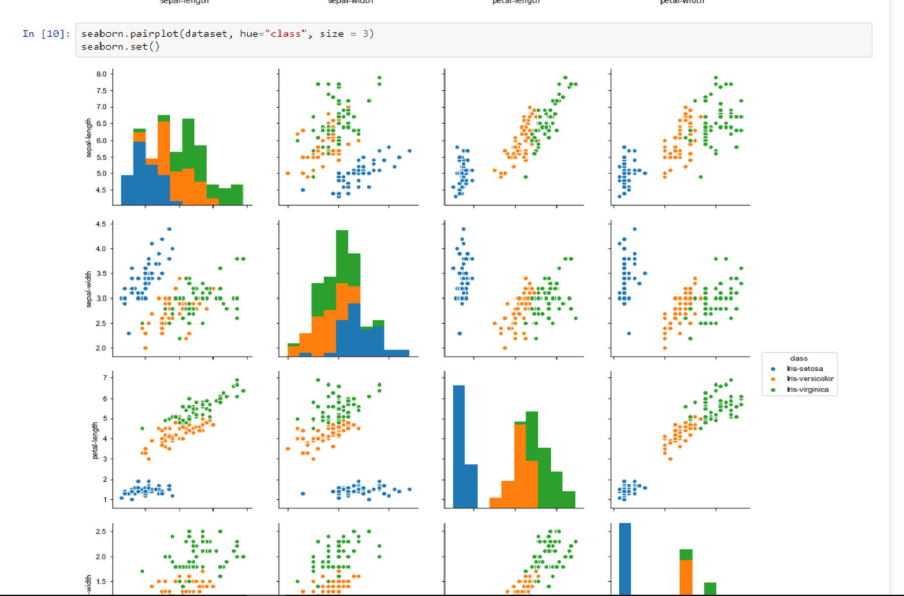

# Iris-Flower-Species
#Classification Of Iris Flower Species On the Basis Of its Physical Attributes using Machine Learning ,Scipy ,Scikit-Learn , Numpy , Pandas And Matplotlib libraries .
<h1 align="center">Iris-Species Identifier</h1> 

Project as part of Machine Learning challenges. 
Visit <a href="https://gauravkeswani.com">Gaurav Keswani</a> to learn more front end development apps. 
Live preview: <a href="https://github.com/Gaurav3170/Iris-Flower-Species">Iris-Species</a>
 

